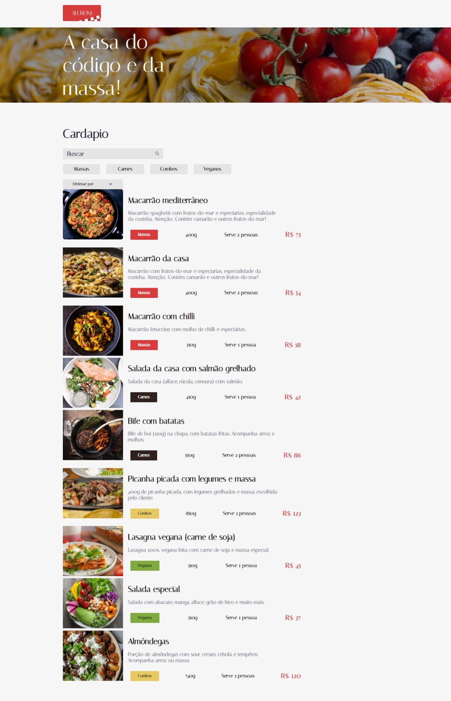

# Aluroni 🍕

O Aluroni é uma aplicação desenvolvida no curso <a href="https://cursos.alura.com.br/course/react-arquivos-estaticos" target="_blank">React: lidando com arquivos estáticos</a>.

## 🎯 Objetivo
Foi pensado para: 
- Criar um projeto do zero com Create React App
- Aprender a utilizar o normalize.css para resetar estilos padrões de navegadores
- Configurar absolute imports para não precisar mais importar arquivos com vários níveis ('../../../')
- Aprender boas práticas em CSS como criar variáveis, criar arquivos para estas variáveis e para breakpoints de media-queries
- Utilizar o pacote classnames para poder utilizar o CSS Modules sem precisar concatenar um monte de estilos CSS e lidar com estilos condicionais
- Aprender como utilizar o SVGR, um pacote que vem no Create React App para importar svgs como componentes React
- Entender como o React entende os imports estáticos tanto via arquivos .js quanto em arquivos de estilos como .scss ou .css. 
- Aprender como importar arquivos estáticos como variáveis via js ou utilizando a pasta public para imports dinâmicos de arquivos estáticos

## 🔨 Funcionalidades do projeto

- Ordenar e filtrar itens
- Aplicar classnames condicionais
- Imports dinâmicos de arquivos estáticos

## ✔️ Técnicas e tecnologias utilizadas

Se liga nessa lista de tudo que usaremos nessa formação:

- `React`
- `Normalize.css`
- `Absolute Imports`
- `SVGR`
- `SCSS`

E muito mais!

## 🛠️ Abrir e rodar o projeto

Para abrir e rodar o projeto, execute `npm i` para instalar as dependências e `npm start` para inicar o projeto.

Depois, acesse <a href="http://localhost:3000/">http://localhost:3000/</a> no seu navegador.
